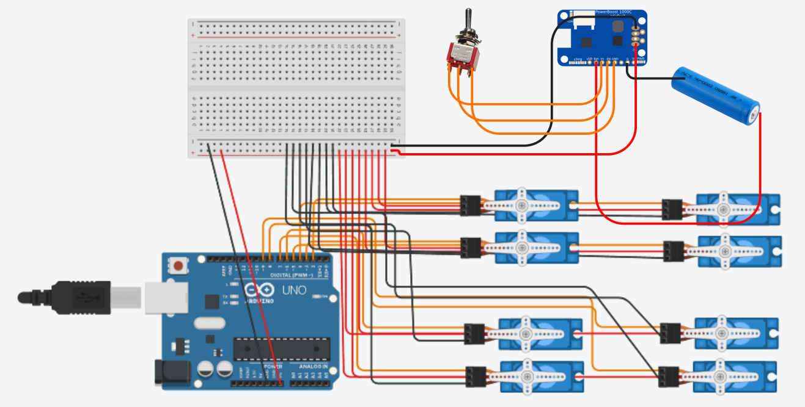

# Botzo V1
Our second interation, the scope was to understnd the inverse kinematic math behind a simple robot dog. It has 2 degrees of freedom and 3D printed components.
 

## Circuit Diagram
 

## Robot Components
- Arduino uno
- Adafruit Powerboost 1000C
- MPU 6050 IMU
- Slide switch
- 8x servo SG90 (9g)
- 18650 Battery Holder
- Li-Ion Battery 18650
- 3D Printer & Materials
- Vaseline, lubricating grease
- Super Glue
- Screws
 

## Structure
 

## Controll
 

## IK study
[Link to our collab studies](https://colab.research.google.com/drive/1-2LA13HfGoF-sFvO-_iz6qzYOe-9e5LA?usp=sharing)

[Link to IK paper](https://www.researchgate.net/publication/320307716_Inverse_Kinematic_Analysis_Of_A_Quadruped_Robot)
 

## Evaluation
 

## Resources
[Our inspiration project 1](https://www.instructables.com/GoodBoy-3D-Printed-Arduino-Robot-Dog/)

[Our inspiration project 2](https://hackaday.io/project/171456-diy-hobby-servos-quadruped-robot)
 

### Videos
[Cool YouTube video explenation of IK](https://www.youtube.com/watch?v=HjmIOKSp7v4)

[YouTube video lesson on IK](https://www.youtube.com/watch?v=RH3iAmMsolo)

[Full lesson on IK](https://www.youtube.com/watch?v=unwUt3kkgvE)
 

### Papers
[Link to IK paper](https://www.researchgate.net/publication/320307716_Inverse_Kinematic_Analysis_Of_A_Quadruped_Robot)
 