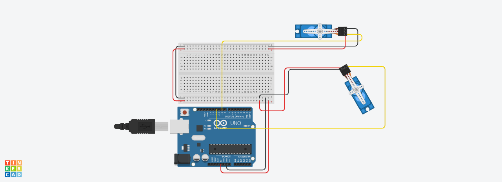

# Sticky Botzo
Our first interation, the scope was to understnd the basic moovmet, angle and problem of this project.
 

## Circuit Diagram (one leg)

[link tinkercad](https://www.tinkercad.com/things/8UBYd9M3AvM)
 

## Robot Components
- Arduino uno

- Servos (x8)

- Joystick

- male to male cables

- USB cable

- Duble side tape

- Wood sticks
 

## Structure
A rectangle wood base that support Arduino and the bread board. At each corner we find a servo. From each servo the femur starts and end in to another servo called knee. 
 

## Controll
Stiky botzo respond to the input taken from the joystik with steps foward using two legs at time. More in particular, when the joystik is set foward, top-left-leg and bottom-right-leg moves togheter, followed buy top-right-leg and bottom-left-leg in order to replicate the real motion of a quadruped.
 

## Evaluation
The result helped us with the basic understand of the problems we was about to facae. We where able to start from something really intuitive and then devellop it in diffrent versions.

It is easy to understand that this robot wasnt able to walk, for a lack of balance sensors and solid structure.

From here we could start thinking on the improvent needed for Botzo v1 such as:

- IMU sensor for balance combine with reverse kinematic algorithme to provide with dinamic angles for the servos and result in a fluid and solid moovment.

- Stronger structure, such as 3D printed parts.

- Need of mathematics and trigonometric function for better trajectory of the moovment of the legs. 
